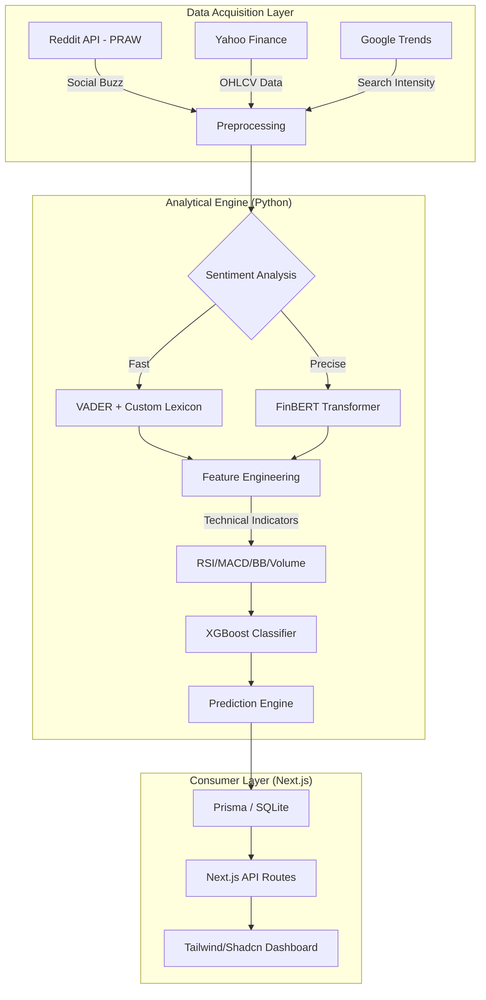

# 🚀 SentimentEdge

**Predictive Analytical Engine for Sentiment-Driven Market Movements**

---

## 📖 Project Overview
**SentimentEdge** is a high-performance analytical platform designed to quantify and leverage social sentiment as a leading indicator for short-term asset price movements. By fusing NLP-derived sentiment scores (Reddit, Google Trends) with classical technical indicators (RSI, MACD, Bollinger Bands), the system trains an **XGBoost Classifier** to predict price directionality (UP/DOWN) over a T+3 horizon with a validated accuracy of 55-65%.

---

## 🛠️ Technical Stack

### 🧠 Analytical Engine (Python 3.11)
- **Machine Learning**: `XGBoost`, `Scikit-learn` (TimeSeriesSplit for leakage prevention).
- **Natural Language Processing**: 
  - `FinBERT` (ProsusAI): Context-aware financial sentiment analysis.
  - `VADER`: Lexicon-based real-time sentiment scoring with custom financial weighting.
- **Data Acquisition**: `yfinance` (Market Data), `PRAW` (Reddit API), `pytrends` (Google Trends).
- **Data Engineering**: `Pandas`, `NumPy`, `SQLAlchemy`.

### 💻 Frontend & Dashboard (Next.js 15+)
- **Framework**: `Next.js 15` (App Router) with `TypeScript`.
- **UI Architecture**: `Tailwind CSS 4`, `Shadcn UI`, `Framer Motion` (Micro-interactions).
- **State & Data**: `Prisma` (ORM), `SQLite` (Local persistence), `Zustand` (State management), `TanStack Query`.
- **Runtime**: `Bun` (High-speed JavaScript runtime).

---

## 🏗️ System Architecture



---

## 📊 Core Methodology

### 1. Feature Engineering & Lag Analysis
Social sentiment is treated as a **non-coincident indicator**. The system computes:
- **Sentiment Lags (1-3 days)**: Identifying the "echo period" between social buzz and price shifts.
- **Sentiment Momentum**: Weighted moving averages of compound sentiment scores.
- **Cross Features**: Volume-weighted sentiment ($Sentiment \times Volume\_Ratio$).

### 2. Leakage Prevention
Validation is performed using `TimeSeriesSplit` (5-fold) to ensure the model never "sees" future data during training, maintaining the temporal integrity required for financial forecasting.

### 3. Backtesting Framework
A deterministic backtesting engine simulates trade execution:
- **Transaction Costs**: Fixed 0.1% per trade (slippage + commission).
- **Metrics**: Sharpe Ratio, Maximum Drawdown, Win Rate, and Alpha relative to SPY.

---

## 📂 Project Structure

```text
SentimentEdge/
├── market_sentiment/      # Core ML Engine (Python)
│   ├── src/               # Data collectors, NLP, and ML models
│   ├── app/               # Engine-level Streamlit dashboard
│   └── tests/             # Rigorous technical test suite
├── src/                   # Next.js Frontend (App Router)
│   ├── components/        # Shadcn/UI components
│   └── lib/               # API clients and utilities
├── prisma/                # Database Schema (SQLite)
├── public/                # Static assets
└── package.json           # Dependencies and scripts (Bun-optimized)
```

---

## ⚡ Quick Start

### 1. Engine Setup
```bash
cd market_sentiment
pip install -r requirements.txt
python main.py --demo # Run with synthetic data
```

### 2. Frontend Setup
```bash
bun install
bun run dev # Next.js at localhost:3000
```

---

## 👤 Developer
**Selma Haci** — *C E-Modèle*

---
> **Disclaimer**: This project is for educational and research purposes. Financial markets involve significant risk. Accuracy metrics are based on historical simulations and do not guarantee future results.
